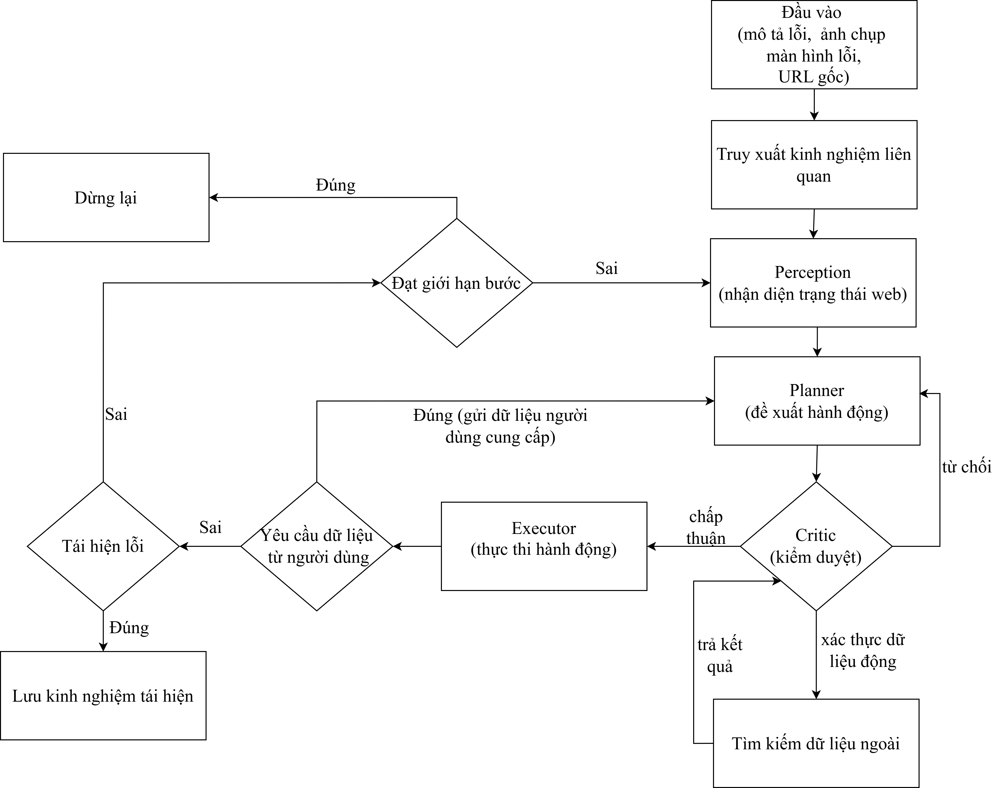

# ReBugger — Hệ thống Tái hiện Bug Tự động

**ReBugger** là hệ thống tái hiện bug web tự động từ mô tả lỗi ngắn gọn và ảnh chụp màn hình. Hệ thống sử dụng kiến trúc LangGraph multi-agent (`Perception → Planner → Critic → Executor`) kết hợp Playwright để điều khiển trình duyệt và kỹ thuật RAG (Retrieval-Augmented Generation) để truy xuất kinh nghiệm từ các lần tái hiện lỗi trước.

## Mục lục

1. [Kiến trúc hệ thống](#1-kiến-trúc-hệ-thống)
2. [Yêu cầu hệ thống](#2-yêu-cầu-hệ-thống)
3. [Cài đặt, cấu hình & chạy local](#3-cài-đặt-cấu-hình--chạy-local)
4. [Triển khai (Deploy)](#4-triển-khai-deploy)
5. [Cấu trúc thư mục](#5-cấu-trúc-thư-mục)

---

## 1. Kiến trúc hệ thống

<p align="center">
  
</p>

---

## 2. Yêu cầu hệ thống

### Phần mềm

- **Docker** >= 24.0 và **Docker Compose** >= 2.20
- **Python** >= 3.11 nếu chạy backend trực tiếp
- **Node.js** >= 22 nếu chạy frontend trực tiếp

---

## 3. Cài đặt, cấu hình & chạy local

### 3.1. Clone repository

```bash
git clone https://github.com/buiftheescoong/KLTN-AutomatedBugReproduction.git
cd AutomatedBugReproduction
```

### 3.2. Cấu hình biến môi trường backend

Tạo file `.env` trong thư mục `rebugger-agent/`:

```bash
cd rebugger-agent
cp .env.example .env
```

Các biến bắt buộc để chạy được:

| Biến môi trường | Bắt buộc khi nào | Mô tả |
|---|---|---|
| `PLANNER_PROVIDER` | Luôn cần | Provider cho Planner: `gemini`, `openai`, `openrouter`, hoặc `together` |
| `PLANNER_MODEL_NAME` | Luôn cần | Model Planner, ví dụ `gemini-2.5-flash` |
| `CRITIC_PROVIDER` | Luôn cần | Provider cho Critic |
| `CRITIC_MODEL_NAME` | Luôn cần | Model Critic |
| `GEMINI_API_KEY` | Khi dùng provider `gemini` | API key Google Gemini |
| `OPENAI_API_KEY` | Khi dùng provider `openai` | API key OpenAI |
| `OPENROUTER_API_KEY` | Khi dùng provider `openrouter` | API key OpenRouter |
| `TOGETHER_API_KEY` | Khi dùng provider `together` | API key Together AI |
| `TAVILY_API_KEY` | Luôn cần | Tìm kiếm dữ liệu động |

Các biến B2 dùng để lưu target screenshot:

| Biến môi trường | Mô tả |
|---|---|
| `B2_KEY_ID` | Backblaze B2 key ID |
| `B2_APPLICATION_KEY` | Backblaze B2 application key |
| `B2_BUCKET_NAME` | Bucket lưu screenshot |
| `B2_ENDPOINT` | S3-compatible endpoint của Backblaze B2 |

Trong file .env.example có giải thích và lấy ví dụ về 1 số biến.


### 3.3. Tùy chỉnh cấu hình agent

Các tham số runtime chính nằm trong `rebugger-agent/src/core/config.py`:

```python
class Settings:
    PLANNER_PROVIDER = _env("PLANNER_PROVIDER")
    PLANNER_MODEL_NAME = _env("PLANNER_MODEL_NAME")
    CRITIC_PROVIDER = _env("CRITIC_PROVIDER")
    CRITIC_MODEL_NAME = _env("CRITIC_MODEL_NAME")
    TEMPERATURE = _float_env("TEMPERATURE", 0.5)

    HEADLESS = False
    BROWSER_TIMEOUT = 30000
    SCREENSHOT_QUALITY = 50
    MAX_STEPS = 32
    LOG_DIR = "././data/logs"
```

### 3.4. Cài đặt và chạy backend local

```bash
cd rebugger-agent

# Tạo virtual environment
python -m venv venv

# Linux/macOS
source venv/bin/activate

# Windows
./venv/Scripts/activate

# Cài đặt thư viện Python
pip install -r requirements.txt

# Cài Chromium cho Playwright
playwright install chromium

# Khởi động API server
uvicorn server:app --host 0.0.0.0 --port 8000 --reload
```

Backend chạy tại:
- API docs: [http://localhost:8000/docs](http://localhost:8000/docs)

### 3.5. Cài đặt và chạy frontend local

Mở terminal mới từ thư mục gốc repo:

```bash
cd frontend
npm install
```

Tạo file `frontend/.env`:

```bash
cp .env.example .env
```

Chạy frontend:

```bash
npm run dev
```

Frontend chạy tại [http://localhost:5173](http://localhost:5173).

---

## 4. Triển khai (Deploy)

### Docker Compose

Đây là cách đơn giản nhất để chạy cả backend API và frontend trong container.

```bash
# Đứng tại thư mục gốc repo
docker compose up --build
```

Lệnh này sẽ:

1. Build image `rebugger-api` từ `rebugger-agent/Dockerfile`.
2. Build image `rebugger-frontend` từ `frontend/Dockerfile`.
3. Khởi động frontend và backend, dùng `rebugger-agent/.env` cho backend.

Kiểm tra:

- Frontend: [http://localhost:8080](http://localhost:8080)
- API docs: [http://localhost:8000/docs](http://localhost:8000/docs)

Chạy nền:

```bash
docker compose up --build -d
```

Xem logs:

```bash
docker compose logs -f rebugger-api
docker compose logs -f frontend
```

Dừng hệ thống:

```bash
docker compose down
```

---

## 5. Cấu trúc thư mục

```
AutomatedBugReproduction/
├── docker-compose.yml              # Chạy backend và frontend bằng Docker Compose
├── rebugger.png                    # Sơ đồ kiến trúc
│
├── rebugger-agent/                 # Backend Python
│   ├── Dockerfile
│   ├── requirements.txt
│   ├── .env.example                # Mẫu biến môi trường
│   ├── .env                        
│   ├── server.py                   # FastAPI app
│   ├── main.py                     # Entry point CLI/dev
│   ├── data/                       # Runtime data: logs, checkpoint, ChromaDB
│   └── src/
│       ├── agents/
│       │   ├── perception.py       # Chụp screenshot, đọc accessibility tree
│       │   ├── planner.py          # LLM đề xuất action
│       │   ├── critic.py           # LLM kiểm duyệt action
│       │   ├── search.py           # Tìm kiếm dữ liệu động bằng Tavily
│       │   └── executor.py         # Thực thi action
│       ├── core/
│       │   ├── config.py           # Cấu hình hệ thống
│       │   ├── graph.py            # LangGraph workflow
│       │   ├── llm.py              # Khởi tạo Planner/Critic LLM
│       │   ├── llm_factory.py      # Resolve provider/model và bind tools
│       │   └── state.py            # Định nghĩa AgentState
│       ├── database/
│       │   ├── db.py               # SQLAlchemy setup
│       │   └── models.py           # ORM models
│       ├── prompts/                
│       ├── tools/
│       │   ├── browsers.py         # Playwright browser manager
│       │   ├── web_tools.py        # Browser action tools
│       │   └── critic_tools.py     # Tool approve/reject/search cho Critic
│       └── utils/
│           ├── b2_storage.py       # Upload screenshot lên Backblaze B2
│           ├── image_helper.py     # Xử lý ảnh screenshot
│           ├── logger.py           # Logging theo session
│           ├── memory_manager.py   # ChromaDB RAG manager
│           ├── metrics.py          # Token/cost/latency metrics
│           └── parser.py           # Chuẩn hóa output/tool call từ LLM
│
├── frontend/                       # React + Vite frontend
│   ├── Dockerfile
│   ├── package.json
│   ├── vite.config.js
│   ├── .env.example                # Mẫu VITE_API_URL
│   └── src/
│       ├── App.jsx
│       ├── App.css
│       ├── index.css
│       └── main.jsx
│
├── frontend_nginx/
│   └── nginx.conf                  # Nginx config cho frontend Docker image
│
├── references/                     # Tài liệu/paper tham khảo
└── crawl_data/                     # Dữ liệu thu thập phục vụ nghiên cứu/chuẩn bị bug report
```
