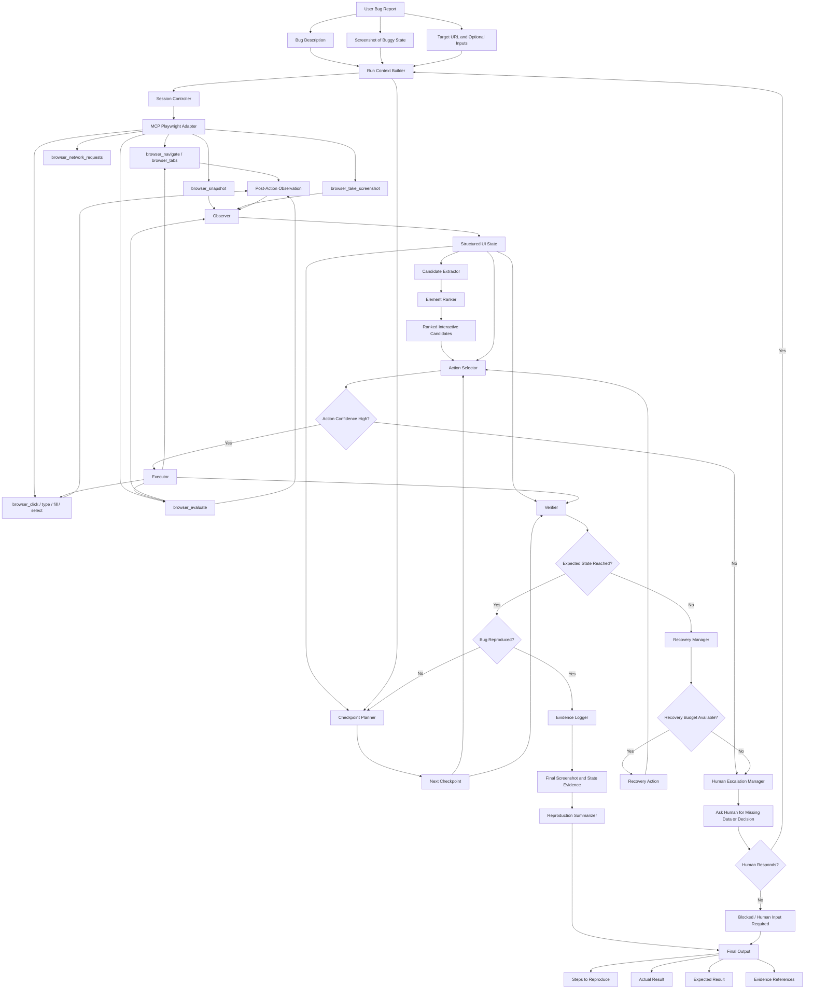
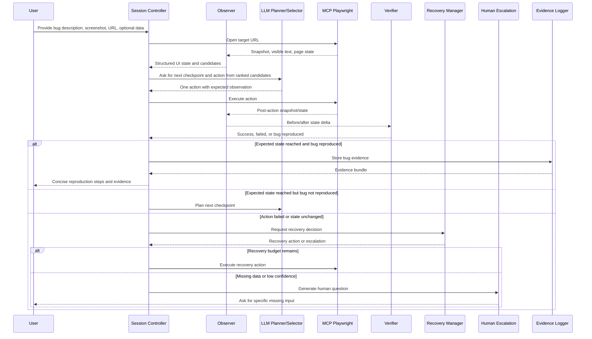

# Bug Reproduction Agent Spec

## Architecture Flow





## 1. Purpose

This document specifies an agent system that reproduces UI bugs from:

- a bug description written by a user
- one or more screenshots of the buggy state
- a target web URL

The system uses Playwright to interact with the web app and an LLM to reason about:

- what the current page state means
- what the next user action should be
- whether the bug has been reproduced
- how to summarize the reproduction steps cleanly

This spec is designed to mirror the working style used in the reproduced cases above:

- operate from user-visible state, not raw DOM alone
- interact through short checkpoints instead of one long plan
- verify every important transition
- recover from wrong clicks and unstable UI
- stop and ask for human input when required information is missing or retry cost is no longer justified
- finish with short, high-signal reproduction steps and evidence

## 2. Non-Goals

This system is not intended to:

- guarantee success on every site or every bug
- understand backend root cause
- patch application code
- replace a human tester for highly ambiguous bugs

The goal is robust, explainable reproduction, not autonomous perfection.

## 3. Core Principles

### 3.1 Operate on visible UI state

The agent should reason from:

- visible text
- accessible roles and names
- visible interactive regions
- active/selected states
- URLs, dialogs, toasts, summaries, counters, prices

It should not treat raw HTML as the primary truth source.

### 3.2 Click interactive surfaces, not decorative children

The system must avoid targeting low-level tags directly when a parent wrapper is the true click target.

Bad primary targets:

- `svg`
- `path`
- icon font glyph nodes
- decorative nested `span`

Preferred targets:

- button/link/textbox/radio elements
- parent wrappers with `cursor:pointer`
- visible containers that change state when clicked
- option rows in open dropdowns

### 3.3 Use checkpoint-based navigation

Do not attempt a full bug flow in one monolithic reasoning pass.

Break reproduction into short checkpoints such as:

- logged in successfully
- reached target page
- target search results visible
- selected target flight
- reached seat booking
- seat selected
- state mismatch observed

Each action should advance exactly one nearby checkpoint.

### 3.4 Every action must be verified

The system must not assume an action succeeded because Playwright executed it.

It must check whether the expected UI state changed:

- URL change
- panel opened
- form value updated
- list item selected
- price updated
- summary text changed
- error/toast/dialog appeared

If expected state did not occur, the action is considered failed.

### 3.5 Bug evidence is state transition evidence

A bug is not just a list of clicks.

A valid reproduction record must capture:

- state before trigger
- trigger action
- state after trigger
- mismatch between actual and expected behavior

## 4. High-Level Architecture

Recommended components:

1. `Session Controller`
2. `Observer`
3. `Candidate Extractor`
4. `Element Ranker`
5. `Checkpoint Planner`
6. `Action Selector`
7. `Executor`
8. `Verifier`
9. `Recovery Manager`
10. `Human Escalation Manager`
11. `Evidence Logger`
12. `Reproduction Summarizer`

## 5. Inputs

Required inputs:

- `bug_description`: natural-language defect description
- `target_url`: starting URL
- `screenshots`: one or more images of the buggy state

Optional inputs:

- credentials
- known path hints
- test data
- browser/device constraints
- locale/timezone

## 6. Outputs

Primary outputs:

- reproduction status: `reproduced`, `not_reproduced`, `blocked`, `inconclusive`
- human input request when blocked by missing information
- concise reproduction steps
- actual result
- expected result
- evidence snapshots
- structured execution log

Optional outputs:

- confidence score
- suspected broken state transition
- likely UI component involved

## 7. Agent Loop

The core loop has five phases:

1. Observe
2. Plan next checkpoint
3. Choose action
4. Verify
5. Recover if needed

Repeat until:

- bug reproduced
- blocked
- human input required
- budget exhausted

The loop must be bounded by explicit budgets:

- maximum actions per run
- maximum retries per checkpoint
- maximum recovery attempts per failure class
- maximum LLM calls per run
- maximum wall-clock duration

The system should prefer asking a concise human question over repeatedly exploring low-confidence paths.

## 8. Observe Phase

### 8.1 Goal

Build a compact but accurate representation of the current UI.

### 8.2 Required observations

At each step collect:

- current URL
- page title
- visible headings
- visible form labels and values
- visible buttons/links/tabs/dropdowns
- visible tables/cards/results
- selected/active items
- dialogs/alerts/toasts
- viewport position if relevant

### 8.3 Preferred data sources

In order:

1. accessibility-style tree or semantic snapshot
2. visible text extraction
3. computed state via DOM evaluation
4. raw DOM only as fallback

### 8.4 Observation schema

```json
{
  "url": "http://example.com/book",
  "title": "Book Flight",
  "page_summary": "Flight search page with results and filters visible",
  "visible_text": [
    "Book Flight",
    "From",
    "To",
    "Search Flights",
    "1 flights found from Ho Chi Minh to Ha Noi"
  ],
  "form_state": {
    "from": "Ho Chi Minh",
    "to": "Ha Noi",
    "departure_date": "2026-04-22",
    "return_date": "2026-04-22",
    "passengers_class": "1 Adults, 0 Child - Economy"
  },
  "active_state": {
    "selected_tab": "Economy",
    "selected_items": ["A50"]
  },
  "feedback_state": {
    "toast": null,
    "dialog": null,
    "error_text": null
  }
}
```

### 8.5 Screenshot usage

The screenshot is not just evidence. It should influence planning by extracting:

- target page identity
- visible bug symptoms
- likely UI section
- expected state to compare against

Examples:

- wrong hotline text
- swapped route not reflected in results
- seat highlight missing
- incorrect fare summary after tab switch

## 9. Candidate Extraction

### 9.1 Goal

Transform the current page into a ranked set of plausible interaction targets.

### 9.2 Candidate types

- `button`
- `link`
- `textbox`
- `radio`
- `checkbox`
- `tab`
- `dropdown_trigger`
- `dropdown_option`
- `list_item`
- `card`
- `seat_cell`
- `icon_button`
- `generic_clickable`

### 9.3 Candidate schema

```json
{
  "id": "cand_42",
  "kind": "generic_clickable",
  "text": "Passengers/Class",
  "role": null,
  "selector_hint": "wrapper near arrow icon",
  "visible": true,
  "enabled": true,
  "cursor_pointer": true,
  "bbox": [686, 327, 262, 148],
  "parent_text": "Passengers/Class",
  "child_text": ["1 Adults, 0 Child - Economy"],
  "state_tags": ["dropdown_trigger"],
  "confidence": 0.84
}
```

### 9.4 Extraction rules

Create candidates from:

- accessible interactive elements
- visible nodes with pointer cursor
- option panels currently expanded
- repeated tiles that act like buttons
- seat grid cells
- icon wrappers

Do not create top-ranked candidates from:

- hidden nodes
- fully decorative icons
- non-visible duplicate text
- deeply nested `path` or `svg` children without standalone click behavior

## 10. Element Ranking

### 10.1 Goal

Rank candidates by likelihood of being the correct next interaction target.

### 10.2 Positive signals

- accessible role present
- visible text matches current subgoal
- pointer cursor
- enabled state
- near relevant labels
- currently in active viewport
- parent wrapper appears to own the click action
- recently opened panel contains the candidate

### 10.3 Negative signals

- hidden or detached
- text duplicated many times
- decorative icon child only
- element in inactive overlay
- stale option from previous state
- outside viewport without scroll relevance

### 10.4 Ranking heuristic

Suggested weighted score:

```text
score =
  role_match * 5 +
  text_match * 5 +
  visible * 4 +
  enabled * 3 +
  pointer_cursor * 3 +
  parent_interactive_surface * 4 +
  in_recently_changed_region * 2 -
  decorative_penalty * 5 -
  hidden_penalty * 8 -
  duplicate_ambiguity_penalty * 3
```

### 10.5 Rule for difficult elements

If a desired visual target is:

- icon
- `svg`
- `path`
- icon-font glyph

then the system must search upward for the nearest visible clickable wrapper and prefer that as the candidate.

## 11. Checkpoint Planner

### 11.1 Goal

Choose the next small milestone toward reproducing the bug.

### 11.2 Planner constraints

The planner must not emit a long full-flow plan every cycle.

It should only output:

- current checkpoint
- next checkpoint
- success condition
- failure condition

### 11.3 Example checkpoints

For a booking bug:

1. log in
2. reach booking page
3. enter route and date
4. execute flight search
5. select matching flight
6. reach seat booking
7. perform seat-related trigger
8. confirm incorrect state transition

### 11.4 Planner output schema

```json
{
  "current_checkpoint": "seat_selected_once",
  "next_checkpoint": "tab_switch_completed",
  "reason": "Need to validate whether selected seat state survives tab change",
  "success_condition": "Business tab opens, then Economy tab restored",
  "failure_condition": "Tab does not switch or seat panel becomes unusable"
}
```

## 12. Action Selector

### 12.1 Goal

Pick one safe next action from ranked candidates.

### 12.2 Allowed action types

- `click`
- `type`
- `fill`
- `select_option`
- `press_key`
- `scroll`
- `hover`
- `wait`
- `evaluate`

### 12.3 Action selection rules

- Prefer one-step actions with clear expected state changes.
- Do not let the LLM invent arbitrary selectors when ranked candidates already exist.
- Avoid multi-action bundles unless the UI demands them.
- Use `evaluate` only when state cannot be observed reliably through normal visible UI methods.

### 12.4 Action output schema

```json
{
  "action_type": "click",
  "target_candidate_id": "cand_42",
  "reason": "This is the visible dropdown trigger for passengers and class",
  "expected_observation": "Passenger panel becomes visible with Adults and Child controls",
  "fallback_if_fail": "Click dropdown arrow icon wrapper instead"
}
```

## 13. Execution

### 13.1 Execution rules

- Execute exactly one planned action.
- Record start timestamp and end timestamp.
- Capture page state after action.
- If action causes navigation or async UI update, wait only as long as needed for the expected state.

### 13.2 Wait strategy

Use targeted waits:

- wait for text
- wait for dialog
- wait for disappearance
- wait for known element state

Avoid arbitrary sleeps except short debounce waits after unstable transitions.

## 14. Verification

### 14.1 Goal

Confirm whether the action produced the intended state change.

### 14.2 Verification checks

By action type:

- click login: authenticated nav present
- click dropdown: panel visible
- choose option: field value updated
- click seat: selected count or fare summary updated
- switch tab: active tab and seat grid content updated
- click search: results summary visible

### 14.3 Verification schema

```json
{
  "action_id": "step_18",
  "expected_observation": "Ticket count increases to 1 and total becomes Rs. 160",
  "actual_observation": {
    "ticket_count": "Ticket 1x",
    "total": "Rs. 160",
    "selected_seat": "A50"
  },
  "success": true,
  "notes": "Seat selected correctly on first attempt"
}
```

### 14.4 Bug verification

A bug should be considered reproduced only when:

- the observed state matches the described faulty behavior
- the mismatch with expected behavior is explicit
- enough evidence is captured to explain it without replaying the whole session

## 15. Recovery Manager

### 15.1 Goal

Handle failures without derailing the whole run.

### 15.2 Common failure classes

- click target intercepted
- stale snapshot
- hidden dropdown option
- typed value not committed
- date format rejected
- browser tab closed
- page navigated unexpectedly
- action succeeded technically but state did not change

### 15.3 Recovery strategies

In order:

1. re-observe page state
2. refresh candidate list
3. try parent interactive wrapper
4. bring target into view
5. trigger prerequisite state first
6. use alternate input format
7. reopen page or tab
8. backtrack to last stable checkpoint

### 15.4 Example recoveries from prior cases

- date input rejected `22/04/2026`, recovered by filling `2026-04-22`
- `SELECT` button intercepted, recovered by first selecting fare card state
- browser backend closed, recovered by opening a fresh tab

### 15.5 Recovery budget

Recovery must be limited. Recommended defaults:

- maximum `2` retries for the same exact action
- maximum `3` alternative actions for one checkpoint
- maximum `2` checkpoint backtracks per run
- maximum `1` page reload before asking for help
- maximum `1` login retry before asking for credentials or account state

If the same observation is reached after different recovery paths, the system should mark the checkpoint as stuck and escalate.

## 16. Human Escalation Manager

### 16.1 Goal

Stop the autonomous loop when the agent lacks information or when additional exploration is likely to waste cost without improving confidence.

### 16.2 Escalation triggers

Ask the human for input when any of these conditions occur:

- credentials are missing, rejected, expired, or require MFA
- required test data is missing, such as order id, user role, specific record, flight, product, or account state
- the screenshot shows a page or state the agent cannot reach after bounded attempts
- multiple UI paths match the description with similar confidence
- the app blocks progress with captcha, payment, email verification, or external approval
- the same checkpoint fails after its retry budget is exhausted
- the agent detects destructive or irreversible actions, such as real purchase, cancellation, deletion, or payment
- the reproduction requires business knowledge not present in the report
- the current page differs materially from the screenshot and no clear navigation path is visible

### 16.3 Escalation output schema

```json
{
  "status": "human_input_required",
  "blocked_checkpoint": "select_target_booking",
  "reason": "The screenshot appears to show an existing booking, but no matching booking is visible for this account.",
  "questions": [
    {
      "id": "booking_identifier",
      "question": "Which booking id or passenger name should be used to reach the screenshot state?",
      "required": true
    }
  ],
  "context_for_human": {
    "last_url": "http://example.com/bookings",
    "attempted_paths": ["Current Bookings", "Book Flight"],
    "evidence": "No visible booking matches the screenshot date 22/04/2026"
  }
}
```

### 16.4 Question design

Human questions must be:

- short
- specific
- answerable without reading logs
- limited to one to three questions at a time
- tied to the blocked checkpoint

Bad question:

```text
What should I do next?
```

Good question:

```text
The account logged in successfully, but no booking matching 22/04/2026 is visible. Which booking id should I open?
```

### 16.5 When not to ask

Do not ask the human if:

- a cheap deterministic recovery is available
- the next action is obvious from visible UI
- the issue is just a transient wait or stale snapshot
- the missing information can be safely inferred from the bug report

### 16.6 Human response handling

When the human answers:

1. add the answer to the run context
2. resume from the blocked checkpoint
3. do not restart the entire session unless required
4. record the human-provided value in the evidence log
5. avoid asking the same question again unless the answer fails

### 16.7 Cost control policy

The system should track:

- `actions_used`
- `llm_calls_used`
- `screenshots_taken`
- `recovery_attempts_by_checkpoint`
- `repeated_observation_count`
- `elapsed_time`

Before each recovery action, compare expected value against cost. If confidence is low and the run is near budget, escalate instead of exploring.

## 17. Evidence Logging

### 17.1 Goal

Produce a machine-readable history that can later be summarized cleanly.

### 17.2 Event schema

```json
{
  "step_id": 12,
  "checkpoint": "seat_selected_once",
  "action": {
    "type": "click",
    "target": "A50"
  },
  "before_state": {
    "ticket": "Ticket 0x",
    "total": "Rs. 10"
  },
  "after_state": {
    "ticket": "Ticket 1x",
    "total": "Rs. 160"
  },
  "result": "success",
  "evidence_tags": ["seat_selected", "fare_updated"]
}
```

### 17.3 Logging rules

- log only state that matters
- do not dump entire DOM each step
- preserve screenshots only at key checkpoints
- mark bug-relevant transitions explicitly

### 17.4 Human escalation logging

When asking the human for input, log:

- blocked checkpoint
- observed state
- failed attempts
- specific missing information
- question asked
- answer received

Human-provided information should appear in final reproduction steps only if it is required to reproduce the bug.

## 18. Screenshot Strategy

Capture screenshots at:

- initial page
- target page reached
- pre-trigger bug state
- post-trigger faulty state
- final evidence state

Screenshots should support, not replace, structured state logs.

## 19. Reproduction Summary Generator

### 19.1 Goal

Generate short, accurate reproduction steps at the end of a long run.

### 19.2 Summary inputs

Use:

- execution log
- last successful path to buggy state
- evidence states
- expected vs actual mismatch

### 19.3 Summary output format

Recommended output:

1. steps to reproduce
2. actual result
3. expected result
4. evidence reference

### 19.4 Example structure

```text
Steps:
1. Log in with ...
2. Navigate to ...
3. Search for ...
4. Select ...
5. Trigger ...

Actual:
Selected seat loses highlight after switching tabs, but fare summary retains old selection and allows re-selection.

Expected:
Selected seat should remain selected or be removed consistently from summary; re-selecting the same seat should not double-charge.
```

### 19.5 Compression rules

When summarizing, keep only:

- meaningful navigation steps
- values required to reproduce
- the bug-triggering action
- the observed mismatch

Remove:

- failed attempts
- internal recovery steps
- low-level selector details

## 20. LLM Prompting Design

### 20.1 Separation of responsibilities

Do not use one giant prompt for everything.

Use separate prompts for:

- page observation summary
- next checkpoint planning
- action selection
- bug verification
- final summarization

### 20.2 Planner prompt requirements

Planner input should include:

- bug description
- screenshot-derived clues
- current structured state
- recent action history

Planner output should be constrained JSON.

### 20.3 Action selector prompt requirements

Action selector input should include:

- current checkpoint
- ranked candidates
- current visible state
- expected next state

The model should choose only from provided candidates unless explicitly allowed to request a recovery observation.

### 20.4 Verifier prompt requirements

Verifier input should include:

- previous state
- action taken
- current state
- bug description

The model should answer:

- did the action work
- was the bug reproduced
- what mismatch proves it

### 20.5 Escalation prompt requirements

Escalation prompt input should include:

- blocked checkpoint
- budget used
- repeated observations
- failed recovery attempts
- missing information hypothesis

The model should output either:

- a single high-confidence recovery action, if still justified
- a human input request, if further exploration is low value

## 21. Practical Rules for Difficult Elements

### 21.1 Dropdowns

Workflow:

1. click trigger
2. re-snapshot
3. extract only visible options
4. click intended option
5. verify field value changed

### 21.2 Icon buttons

Workflow:

1. find nearby labeled control region
2. target clickable wrapper, not glyph child
3. verify counter/state delta

### 21.3 Tabs

Workflow:

1. click named tab
2. verify active tab state
3. verify panel contents changed
4. compare old and new state

### 21.4 Seat grids and repeated cells

Workflow:

1. identify visible grid mode
2. click target cell by text
3. verify:
   - selected count
   - highlight style or state
   - summary change
4. after mode/tab switch, check whether state persisted consistently

### 21.5 Overlays and pointer interception

If click is intercepted:

1. inspect active overlay/card
2. determine which parent surface owns pointer events
3. click prerequisite card/state first
4. retry target

## 22. Success Criteria

A run is successful if it can produce:

- a deterministic sequence of user actions
- a clear faulty state matching the bug description
- a concise final summary
- supporting evidence

## 23. Recommended Implementation Order

1. Build structured observer
2. Build candidate extractor and ranker
3. Add short-horizon checkpoint planner
4. Add one-action executor and verifier
5. Add recovery manager
6. Add human escalation manager
7. Add budget and repeated-state detection
8. Add evidence log
9. Add final summary generator

## 24. Minimal Viable System

If building incrementally, start with:

- Playwright controller
- page observer
- candidate extraction from visible interactive elements
- planner with one-step checkpoint output
- click/type/fill executor
- simple verifier
- retry budget and human escalation status
- compact event log

This is enough to outperform a raw DOM + open-ended LLM loop.

## 25. Recommended Advanced Features

- screenshot-to-clue extraction
- viewport-aware candidate ranking
- duplicate text disambiguation
- state-delta comparison
- retry budget per checkpoint
- human question generation
- cost-aware stopping policy
- confidence scoring
- auto-generated evidence bundle

## 26. Final Recommendation

If you want behavior close to the reproduction style used in the previous cases, the most important design choice is this:

Do not let the LLM directly drive arbitrary selectors over raw DOM.

Instead:

- observe the UI as structured visible state
- extract and rank plausible interactive surfaces
- let the LLM choose the next action from constrained options
- verify every transition
- log bug-relevant state changes continuously

That design does not guarantee perfect reproduction on every site, but it is the most reliable way to approach the level of interaction quality, recovery ability, and concise reproduction reporting demonstrated in the earlier cases.
